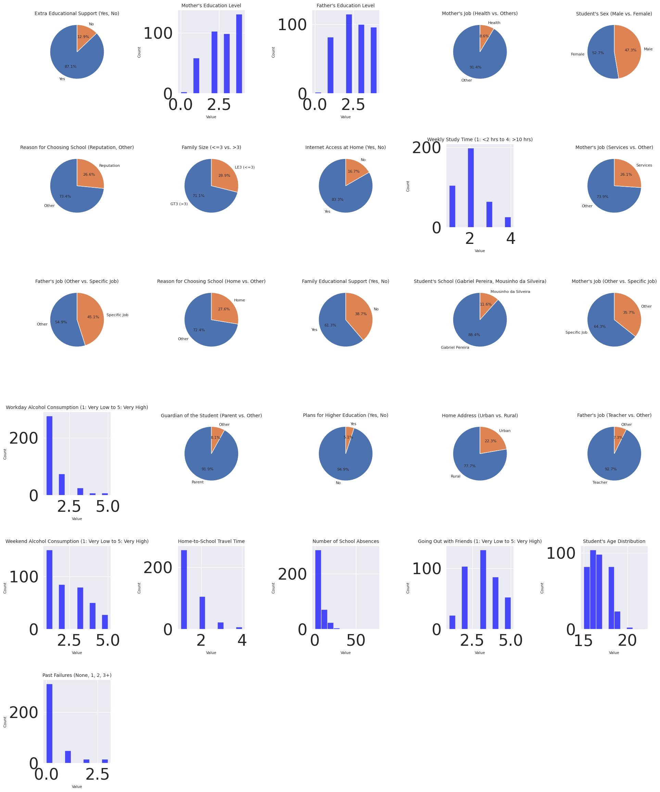
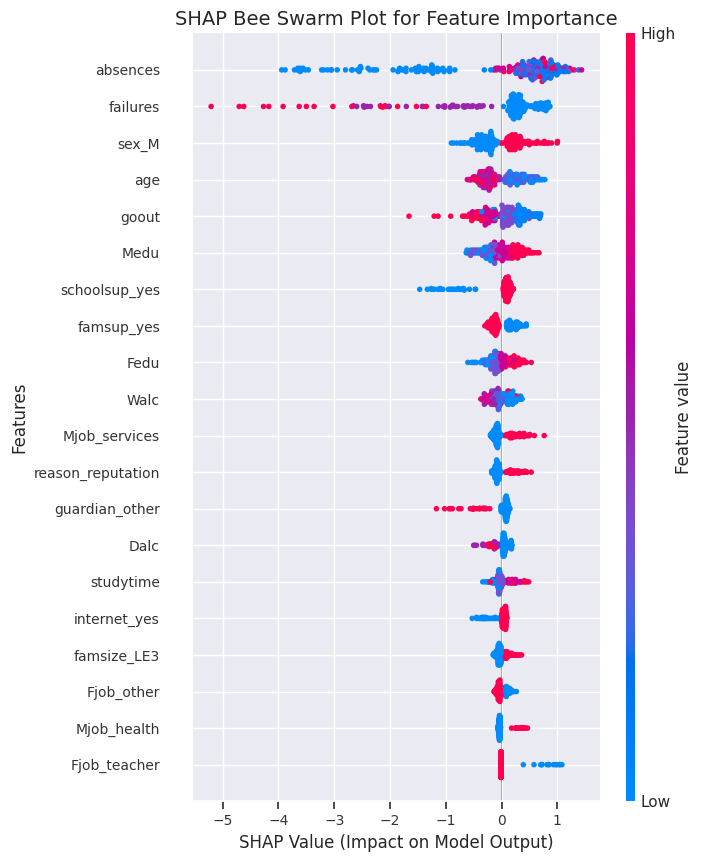
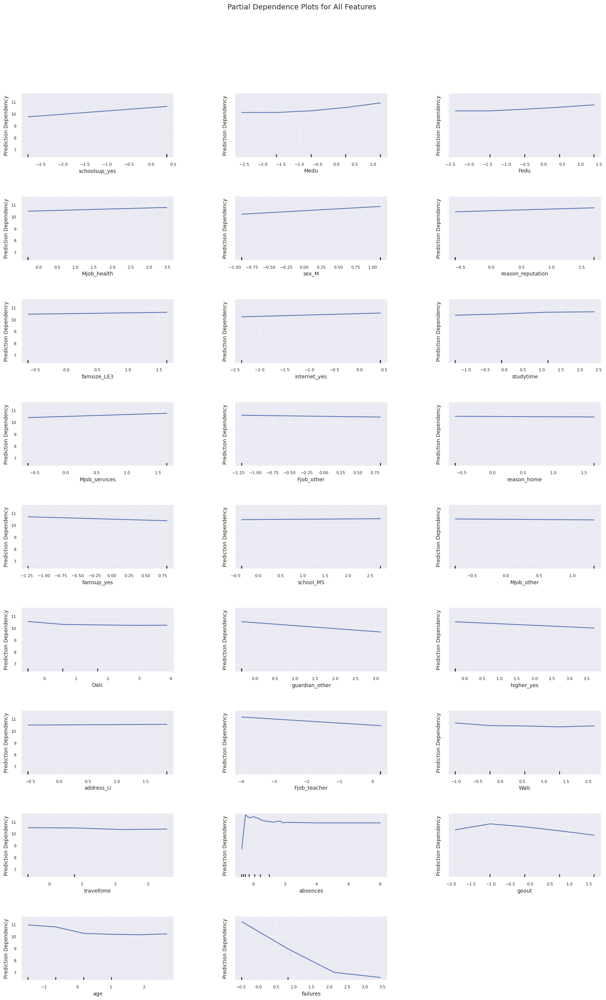

# **Student Grade Prediction Project**

This project aims to predict student grades based on their activities, demographic features, and other influential factors using machine learning models. The project employs multiple regression models, evaluates them using various metrics, and optimizes performance through hyperparameter tuning.

## **Table of Contents**
1. [Introduction](#introduction)
2. [Dataset](#dataset)
3. [Features](#features)
4. [Project Workflow](#project-workflow)
5. [Models and Evaluation](#models-and-evaluation)
6. [Ethics](#ethics)
7. [Important Figures](#important-figures)
8. [Acknowledgments and Disclosures](#acknowledgments-and-disclosures)

---

## **Introduction**
This project focuses on leveraging machine learning techniques to predict student grades based on their activities and personal attributes. It explores the relationships between input features and student performance to guide interventions for better academic outcomes.

---

## **Dataset**
The dataset used to train the model was found on kaggle.com, a public resource for code and datasets available internationally. Specifically, the data collected was from 2 Portuguese secondary schools over a broad range of student demographics. The discussion of data collection and distribution is discussed in the ethics files available at the end of the README file. 

The dataset source can be found on many Kaggle pages. This dataset was found and further explained in Cortez, Paulo & Silva, Alice. (2008). *Using data mining to predict secondary school student performance*. EUROSIS. 

---

### **Objective**
- To develop and compare regression models to predict student grades.
- To analyze model performance using metrics like **Accuracy**, **R²**, **RMSE**, and **MAE**.
- Creat a user freindly app utilizing the model.

---

## **Features**
The dataset includes:
- **Categorical Features**: Encoded for use in the models (e.g., `school`, `sex`, `address`).
- **Numerical Features**: Such as `studytime`, `failures`, and `absences`.
- **Target Variable**: The final grade of the student.

Key transformations include:
- Stratified sampling based on `Medu` and `failures`.
- One-hot encoding for categorical variables.

---

## **Project Workflow**
1. **Data Preprocessing**
   - Handling missing values.
   - Feature scaling and encoding.
   - Train-test split using `StratifiedShuffleSplit`.

2. **Model Development**
   - Linear Regression.
   - Random Forest, Decision Tree, Gradient Boosting, and others.
   - Hyperparameter tuning for optimal performance.

3. **Evaluation**
   - Metrics used: **Accuracy (R²)**, **RMSE**, and **MAE** across Train, Validation, and Test sets.

4. **Results Compilation**
   - Results saved to `model_results.csv`.

---

## **Models and Evaluation**
The following models were trained and evaluated:
- **Linear Regression**
- **Random Forest**
- **Decision Tree**
- **Gradient Boosting**
- **K-Nearest Neighbors**
- **Support Vector Machine**
- **Artificial Neural Networks**
- **Feature-Based Regression (Ridge)**
- **XGBoost**
- **LightGBM**
- **CatBoost**

The best model was determined to be the Random Forest model cross-validated with Bayesian Search to get the following best performance hyperparameters:
```python

    ('max_depth', 10),
    ('min_samples_leaf', 2),
    ('min_samples_split', 6),
    ('n_estimators', 50)

```

The model was saved as a .pkl file (best_bayesian_random_forest_model.pkl) to be used in the app.

---

## **Ethics**
Ethical considerations including Deon Ethics Checklist and Ethics Data Card Checklist were used to evaluate the social impact of the model and app. These are available through the following streamlit app links:

Deon Ethics:
https://mldeonethics-jtppmpppkpa5bjjjkws6pm.streamlit.app/

Ethics Data Card:
https://mlethicsdatacard-njdaykz4wx5vxcbcnd8twf.streamlit.app/

---

## **Important Figures**
Through trining the model we only considered the features with over 0.05 correlation to the model. To understand any internal biases of the dataset, the distribution, bee swarm plot, and partial dependence plots are shown below.




---

## **Acknowledgments and disclosures**
#### **Acknowledgments**
We would like to thank the following individuals and organizations for their contributions to the **Student Grade Prediction Project**:
- **Educators and Students**: For participating in the initial data collection surveys and providing invaluable insights into the real-world challenges of academic performance.
- **The Kaggle Community**: For creating a resource for coding and dataset acquisition. 
- **Project Advisors and Collaborators**: For their guidance and feedback throughout the ethical evaluation process and the development of the application, thank you to Professor Jude Okolie.
- **Streamlit and Open-Source Community**: For providing tools and libraries that facilitated the seamless creation of this app.

#### **Disclosures**
- **AI Usage**: 
  - This project uses artificial intelligence (AI) and machine learning (ML) models to predict student performance. These models were trained on historical data and make predictions based on patterns in the dataset.
  - The AI is designed to assist educators by offering additional insights, but it is not a substitute for human judgment and should not be relied upon as the sole decision-making tool.
- **Limitations**:
  - The model's predictions are based on the dataset's quality and representativeness. Any biases or limitations in the dataset may influence the model's outputs.
  - All users are encouraged to interpret the predictions with caution and use them as a supplementary tool rather than a definitive measure.
- **Responsible Use**:
  - This app is intended for use within the context of educational support. It should not be used for any other purpose or in ways that might negatively impact students or educators.

We acknowledge that ethical AI usage requires continuous monitoring and improvement. Feedback from stakeholders is welcomed to ensure the project's goals align with its intended positive impact.

### **AI Assistance in Development**
This project leveraged AI tools, including OpenAI's ChatGPT, to assist with various aspects of its development. These contributions include:

Drafting initial code structures for the Streamlit application.
Refining and optimizing Python code for functionality and clarity.
Generating documentation such as this README, ethical evaluations, and checklist summaries.
Providing recommendations for project structuring and ethical considerations.
The AI assistance served as a support tool to enhance productivity and ensure thorough documentation. All outputs from AI were reviewed, tested, and tailored to meet the specific needs of this project. The responsibility for the final implementation, accuracy, and ethical compliance lies with the project team.
